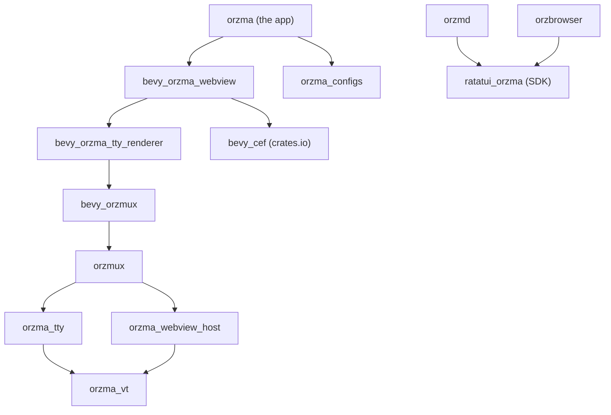

# Contributing to orzma

<!-- ANCHOR: guide -->
Thanks for helping! This guide covers the development setup, how the code is
organized, the conventions the code follows, how to send a change, and how to
work on the documentation.

## Development setup

orzma builds on macOS, on Windows 10 1809+ / 11 (x64), and on Linux (x86_64,
glibc 2.35 or later).

You need:

- Rust, installed with [rustup](https://rustup.rs). The repository pins the
  toolchain (1.95) in `rust-toolchain.toml`, and rustup installs it on first use.
- Node.js 22 or later, and pnpm 10.30.2 (the `packageManager` in
  `package.json`): `npm install -g pnpm@10.30.2`.
- [just](https://just.systems).
- On Windows, CMake and Ninja: `winget install Kitware.CMake Ninja-build.Ninja`.
- On Linux, the build packages the release build uses — on Ubuntu or Debian,
  `sudo apt install build-essential pkg-config libasound2-dev libudev-dev
  libwayland-dev libxkbcommon-dev libfontconfig1-dev` — and the runtime
  libraries that [Installation](https://not-elm.github.io/orzma/installation.html#linux)
  lists for the tarball.

Then, from the repository root:

```sh
pnpm install
just setup-cef   # one-time: installs the Chromium Embedded Framework and its render process
just run         # builds and runs orzma
```

| Command | What it does |
| --- | --- |
| `just build` | Build the workspace. |
| `just run` | Run orzma. |
| `just test` | Run every Rust test. |
| `pnpm -r test` | Run the TypeScript tests. |
| `pnpm check-types` | Type-check the TypeScript packages. |
| `just fix-lint` | Apply clippy fixes, rustfmt, and biome fixes. |
| `just install-apps` | Build and install `orzmd` and `orzbrowser`. |

On Windows, `just build`, `just run`, and `just test` set `CEF_PATH` for you.
When you run cargo yourself — including through `just fix-lint` — set
`CEF_PATH` to `%USERPROFILE%\.cache\orzma\cef` first.

## Architecture

orzma is a single native GUI application. Terminal emulation, GPU rendering,
the multiplexer, input, and webview rendering all run in one
[Bevy](https://bevyengine.org) app; there is no daemon, HTTP server, or
browser-side frontend.



Arrows point from a crate to the crates it uses; a dependency already implied by
a path through other crates is left out.

| Crate | Role |
| --- | --- |
| `orzma` (`src/`) | The app: window, input, UI, and the plugins below. |
| `orzma_vt` | Terminal emulation: the screen, scrollback, escape sequences, and selection. |
| `orzma_tty` | Runs the shell under a PTY and drives `orzma_vt`. |
| `orzmux` | The multiplexer backend: a thread that owns every pane and the pane layout. |
| `bevy_orzmux` | Connects the backend to the Bevy app. |
| `bevy_orzma_tty_renderer` | Draws the terminal grid on the GPU. |
| `orzma_webview_host` | The webview server: the control socket and every program's registrations, placements, and focus. |
| `bevy_orzma_webview` | Draws webviews with CEF, serves their content through the `orzma://` scheme, and relays the `window.orzma` bridge. |
| `orzma_configs` | Loads `config.toml`. |
| `ratatui_orzma` (`sdk/`) | The Rust SDK for webview apps. `@orzma/web` is its page-side companion. |

At run time, the `orzmux` thread owns each pane's PTY and terminal state and runs
the webview host. The app sends it commands and receives layout snapshots,
frames, and webview events, which `bevy_orzma_tty_renderer` and
`bevy_orzma_webview` draw. Programs in a pane reach the webview host through the
[webview protocol](https://not-elm.github.io/orzma/protocol-reference.html).

## Conventions

- Code comments are written in English.
- Rust code follows
  [.claude/rules/rust.md](https://github.com/not-elm/orzma/blob/main/.claude/rules/rust.md),
  and TypeScript follows
  [.claude/rules/typescript.md](https://github.com/not-elm/orzma/blob/main/.claude/rules/typescript.md).
  They cover the comment rules, doc comments, imports, and error handling.
- Run `just fix-lint` before sending a change. CI runs `cargo fmt --check`,
  `cargo clippy` with warnings as errors, the tests, `cargo doc`, cargo-deny,
  the third-party license check, and `pnpm lint:ci`.
- Commit messages follow the Conventional Commits style of the history, for
  example `feat(webview): …`, `fix(input): …`, or `docs: …`.

## Pull requests

Open a pull request against `main` and fill in the template. Release notes are
grouped by label, so add one of `breaking-change`, `enhancement`,
`performance`, `bug`, `documentation`, or `dependencies` — or `skip-changelog`
to leave the change out of the notes.

<!-- ANCHOR_END: guide -->

## Releasing

Maintainers cut a release from `main`:

1. Run `just bump-version X.Y.Z`, then `cargo update --workspace` and
   `just licenses` so that `Cargo.lock` and `licenses/THIRD-PARTY-LICENSES.md`
   follow. Merge the pull request once CI is green.
2. Tag the merge commit and push the tag:
   `git tag vX.Y.Z && git push origin vX.Y.Z`.
3. Wait for the `release` workflow run to succeed. It builds every platform and
   leaves a draft release, linked from the run's summary. Nothing is public yet.
4. Open the draft, check that it holds the four packages, write a description
   above the generated notes, and publish it with "Set as the latest release"
   checked. Do not attach other files: the `post-release` check accepts exactly
   those four.
5. Publishing starts the `post-release` workflow, which bumps the Homebrew
   cask, publishes the SDK to npm and crates.io, and deploys the user guide.

| If this fails | Do this |
| --- | --- |
| The `plan` job (a version file disagrees with the tag) | Fix the versions on `main`, then move the tag as described in the next row. |
| A build in `release`, before any draft exists | Re-run the failed jobs. If the fix needs a code change, merge it to `main`, cancel the old run, and move the tag: `git push --delete origin vX.Y.Z`, then `git tag -f vX.Y.Z` on the new commit and `git push origin vX.Y.Z`. |
| The `draft` job | Re-run the failed jobs within 7 days, while the build artifacts are kept; the job refills the same draft and keeps your description. After that, re-run all jobs. |
| A problem you find in the draft | Copy your description, delete the draft, merge the fix, and move the tag as above. |
| You published the draft before the `release` run succeeded | Treat it as an incident: `post-release` refuses a release with missing assets, so nothing else goes out. Do not re-run the draft job; release a new version. |
| A `post-release` job | Re-run the failed jobs, or run `gh workflow run post-release.yml --ref vX.Y.Z`. Both run the workflow files as they were at the tag, so a bug in those files needs a new version. |
| `post-release` skipped Homebrew and the user guide ("is not the Latest release") | Mark the release as Latest on its release page, then run `gh workflow run post-release.yml --ref vX.Y.Z`. |

Once a release is published, fix problems with a new version; never move its
tag.

<!-- ANCHOR: documentation -->

## Documentation

The user guide lives in `docs/book` and is built with
[mdBook](https://rust-lang.github.io/mdBook/). It is published to
<https://not-elm.github.io/orzma/> when a release is published.

```sh
just setup-book   # one-time: installs the pinned mdBook and mdbook-mermaid
just book-serve   # preview with live reload
just book         # build into target/book
```

- When a change affects what users see — a configuration key, a shortcut, or
  the webview protocol — update the matching page under `docs/book/src` in the
  same pull request.
- Draw diagrams with [Mermaid](https://mermaid.js.org) in a code block tagged
  `mermaid`. In a `sequenceDiagram`, write a `;` inside a message as `#59;`.
- Link to repository files from the book with absolute URLs such as
  `https://github.com/not-elm/orzma/blob/main/...`; the published book cannot
  follow relative links out of `docs/book`.
- To upgrade mdBook or mdbook-mermaid, change the versions in the `justfile`.
  After upgrading mdbook-mermaid, delete `docs/book/mermaid.min.js` and
  `docs/book/mermaid-init.js` and run `mdbook-mermaid install docs/book`,
  because it does not overwrite existing files. The lychee version is pinned in
  `.github/workflows/book.yml`.
- When the SDK moves to a new ratatui version, update the version in the Setup
  section of `docs/book/src/building-webview-apps.md` and in
  `sdk/ratatui_orzma/README.md`.

<!-- ANCHOR_END: documentation -->
