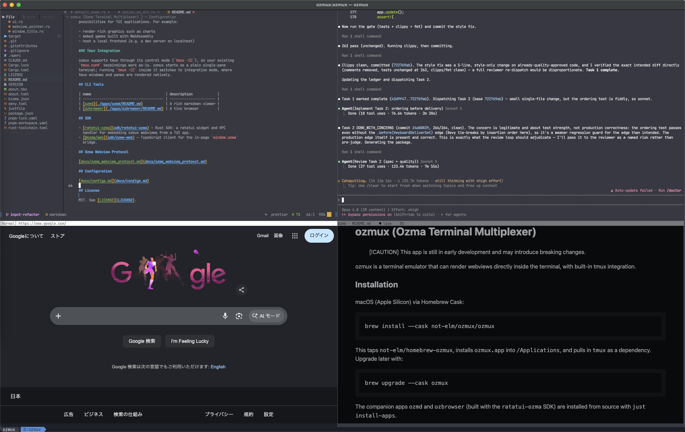

# orzma

> [!CAUTION]
> This app is still in early development and may introduce breaking changes.

orzma is a terminal emulator that can render webviews directly inside the
terminal, with built-in tmux integration.



## Installation

macOS (Apple Silicon) via Homebrew Cask:

```bash
brew install --cask not-elm/orzma/orzma
```

This taps `not-elm/homebrew-orzma`, installs `orzma.app` into `/Applications`,
and pulls in `tmux` as a dependency. Upgrade later with:

```bash
brew upgrade --cask orzma
```

The companion apps `orzmd` and `orzbrowser` (built with the `ratatui-orzma` SDK)
are installed from source with `just install-apps`.

## Features

### Webview

orzma can display webviews inside the terminal, which opens up new
possibilities for TUI applications. For example:

- render rich graphics such as charts
- embed games built with WebAssembly
- host a local frontend (e.g. a dev server on localhost)

### Tmux Integration

orzma supports tmux through its control mode (`tmux -CC`), so your existing
`tmux.conf` keybindings work as-is. orzma starts as a plain single-pane
terminal; running `tmux -CC` inside it switches to integration mode, where
tmux windows and panes are rendered natively.

## CLI Tools

| name                                      | description            |
| ----------------------------------------- | ---------------------- |
| [orzmd](./apps/orzmd/README.md)           | A rich markdown viewer |
| [orzbrowser](./apps/orzbrowser/README.md) | A tiny browser         |

## SDK

- [ratatui-orzma](sdk/ratatui-orzma) — Rust SDK: a ratatui widget and RPC
  handler for embedding orzma webviews from a TUI app.
- [@orzma/web](sdk/orzma-web) — TypeScript client for the in-page `window.orzma`
  bridge.

## Orzma Webview Protocol

[docs/orzma_webview_protocol.md](docs/orzma_webview_protocol.md)

## Configuration

[docs/configs.md](docs/configs.md)

## License

MIT. See [LICENSE](LICENSE).
