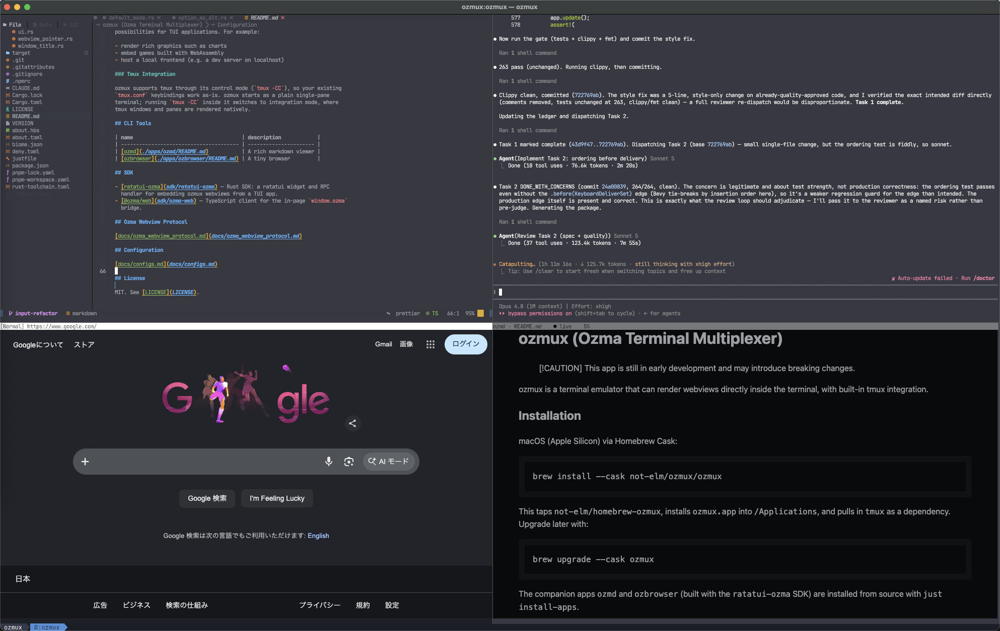

# orzma

> [!CAUTION]
> This app is still in early development and may introduce breaking changes.
>
> The entire codebase is currently being redesigned. The documentation in this
> README and under `docs/` describes the previous design, so the actual
> behavior may differ from what is documented here until the redesign lands.

orzma is a terminal emulator that can render webviews directly inside the
terminal.



## Installation

macOS (Apple Silicon) via Homebrew Cask:

```bash
brew install --cask not-elm/orzma/orzma
```

This taps `not-elm/homebrew-orzma` and installs `orzma.app` into
`/Applications`. Upgrade later with:

```bash
brew upgrade --cask orzma
```

The companion apps `orzmd` and `orzbrowser` (built with the `ratatui_orzma` SDK)
ship bundled inside `orzma.app`, so the Homebrew Cask install already includes
them. To build and install them from source instead, run `just install-apps`.

### Windows (from source)

Windows 10 1809+ / 11, x64. Prerequisites: the Rust toolchain (rustup),
[just](https://just.systems) (`winget install Casey.Just`), CMake and Ninja
(`winget install Kitware.CMake Ninja-build.Ninja`), and PowerShell.

```powershell
just setup-cef   # one-time: CEF framework + render process into ~/.local/share/cef
just run
```

`just`-driven builds download the pinned CEF once into `~/.cache/orzma/cef`; bare `cargo` commands download it into the build directory instead, so set `CEF_PATH` to that cache directory persistently in your environment if you prefer plain `cargo` (switching between the two relinks CEF each time). Re-run `just setup-cef` after a CEF version bump:
the exported directory is not version-checked.

The first pane opens PowerShell 7 if `pwsh` is on `PATH`, else Windows
PowerShell, else `cmd.exe`; set `[orzma] shell` in
`~/.config/orzma/config.toml` to override (a configured path must carry its
`.exe` extension). `orzmd`, `orzbrowser`, and the `ratatui_orzma` SDK are not
yet available on Windows; `cargo build --workspace` is Unix-only for now (use
`just build` / `just test`).

## Features

### Webview

orzma can display webviews inside the terminal, which opens up new
possibilities for TUI applications. For example:

- render rich graphics such as charts
- embed games built with WebAssembly
- host a local frontend (e.g. a dev server on localhost)

## CLI Tools

| name                                      | description            |
| ----------------------------------------- | ---------------------- |
| [orzmd](./apps/orzmd/README.md)           | A rich markdown viewer |
| [orzbrowser](./apps/orzbrowser/README.md) | A tiny browser         |

## SDK

- [ratatui_orzma](sdk/ratatui_orzma) — Rust SDK: a ratatui widget and RPC
  handler for embedding orzma webviews from a TUI app.
- [@orzma/web](sdk/orzma-web) — TypeScript client for the in-page `window.orzma`
  bridge.

## Orzma Webview Protocol

[docs/orzma_webview_protocol.md](docs/orzma_webview_protocol.md)

## Configuration

[docs/configs.md](docs/configs.md)

## License

MIT. See [LICENSE](LICENSE).
