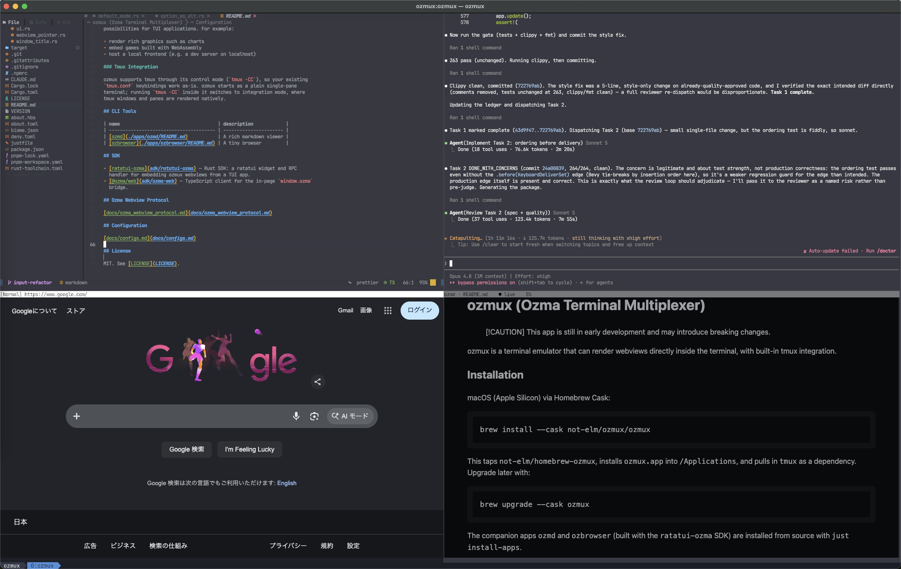

# orzma

> [!CAUTION]
> This app is still in early development and may introduce breaking changes.
>
> The entire codebase is currently being redesigned. The documentation in this
> README and under `docs/` describes the previous design, so the actual
> behavior may differ from what is documented here until the redesign lands.

orzma is a terminal emulator that can render webviews directly inside the
terminal.



## Installation

macOS (Apple Silicon) via Homebrew Cask:

```bash
brew install --cask not-elm/orzma/orzma
```

This taps `not-elm/homebrew-orzma` and installs `orzma.app` into
`/Applications`. Upgrade later with:

```bash
brew upgrade --cask orzma
```

The companion apps `orzmd` and `orzbrowser` (built with the `ratatui_orzma` SDK)
ship bundled inside `orzma.app`, so the Homebrew Cask install already includes
them. To build and install them from source instead, run `just install-apps`.

### Windows (installer)

Requires Windows 10 1809 or later (x64).

Download `orzma-<version>-x64.msi` from the [latest release](https://github.com/not-elm/orzma/releases/latest) and run it. The installer is per-user: it needs no administrator prompt, installs into `%LocalAppData%\Programs\orzma`, and puts `orzma`, `orzmd`, and `orzbrowser` on your `PATH`.

### Linux (x86_64)

Requires glibc 2.35 or later. Use either the `.deb` or the tarball, not both: with both installed, `~/.local/bin/orzma` usually shadows `/usr/bin/orzma`.

#### Ubuntu / Debian (.deb)

Tested on Ubuntu 22.04 and 24.04; other Debian-based distributions with glibc 2.35 or later may work.

Download `orzma_<version>_amd64.deb` from the [latest release](https://github.com/not-elm/orzma/releases/latest), then:

```bash
sudo apt install ./orzma_<version>_amd64.deb
```

apt installs the system libraries orzma needs along with it. To uninstall, run `sudo apt remove orzma` (your settings in `~/.config/orzma` are kept).

#### Other distributions (tarball)

Install the system libraries the embedded Chromium and orzma itself need. The package names below are Ubuntu/Debian's; install your distribution's equivalents.

Ubuntu 22.04 / Debian 12:

```bash
sudo apt install libnss3 libnspr4 libatk1.0-0 libatk-bridge2.0-0 libcups2 libdrm2 \
  libgbm1 libxkbcommon0 libxcomposite1 libxdamage1 libxrandr2 libxfixes3 \
  libpango-1.0-0 libcairo2 libgtk-3-0 libasound2 libdbus-1-3 libglib2.0-0 \
  libudev1 libwayland-client0 libfontconfig1 \
  libx11-6 libx11-xcb1 libxcursor1 libxi6 libxkbcommon-x11-0 libvulkan1 libegl1
```

Ubuntu 24.04+ / Debian 13+ (where `libasound2` is renamed `libasound2t64`):

```bash
sudo apt install libnss3 libnspr4 libatk1.0-0 libatk-bridge2.0-0 libcups2 libdrm2 \
  libgbm1 libxkbcommon0 libxcomposite1 libxdamage1 libxrandr2 libxfixes3 \
  libpango-1.0-0 libcairo2 libgtk-3-0 libasound2t64 libdbus-1-3 libglib2.0-0 \
  libudev1 libwayland-client0 libfontconfig1 \
  libx11-6 libx11-xcb1 libxcursor1 libxi6 libxkbcommon-x11-0 libvulkan1 libegl1
```

Download `orzma-<version>-x86_64-linux.tar.gz` from the [latest release](https://github.com/not-elm/orzma/releases/latest), then:

```bash
tar xzf orzma-<version>-x86_64-linux.tar.gz
cd orzma-<version>-x86_64-linux
./install.sh
```

The installer is per-user and needs no root: it copies orzma into `~/.local/share/orzma`, links `~/.local/bin/orzma`, and adds orzma to your desktop's application list. You can also run `./orzma` straight from the extracted directory without installing. To uninstall, run `~/.local/share/orzma/uninstall.sh` (your settings in `~/.config/orzma` are kept).

## Features

### Webview

orzma can display webviews inside the terminal, which opens up new
possibilities for TUI applications. For example:

- render rich graphics such as charts
- embed games built with WebAssembly
- host a local frontend (e.g. a dev server on localhost)

## CLI Tools

| name                                      | description            |
| ----------------------------------------- | ---------------------- |
| [orzmd](./apps/orzmd/README.md)           | A rich markdown viewer |
| [orzbrowser](./apps/orzbrowser/README.md) | A tiny browser         |

## SDK

- [ratatui_orzma](sdk/ratatui_orzma) — Rust SDK: a ratatui widget and RPC
  handler for embedding orzma webviews from a TUI app.
- [@orzma/web](sdk/orzma-web) — TypeScript client for the in-page `window.orzma`
  bridge.

## Orzma Webview Protocol

[docs/orzma_webview_protocol.md](docs/orzma_webview_protocol.md)

## Configuration

[docs/configs.md](docs/configs.md)

## License

MIT. See [LICENSE](LICENSE).
