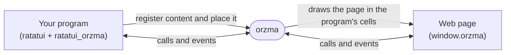

# Building Webview Apps

This page walks through writing a terminal app that shows a web page, with
[`ratatui_orzma`](https://docs.rs/ratatui_orzma), the Rust SDK, and through
having the page talk back with
[`@orzma/web`](https://www.npmjs.com/package/@orzma/web). Each step is a
complete example from the repository.

## How it fits together



Your program runs inside an orzma pane and draws its interface with ratatui,
leaving a rectangle of cells for the page. The SDK registers the page with
orzma, places it wherever the widget is drawn, and carries messages between
your program and the page.

## Setup

Add the SDK, the version of ratatui it is built against, and serde:

```sh
cargo add ratatui_orzma ratatui@0.29
cargo add serde --features derive
```

Your app must use the same ratatui version as `ratatui_orzma`, which is built
against ratatui 0.29; with another version, the SDK's widget and backend types
do not match yours. The examples use let chains, which need Rust 1.88 or later
and the 2024 edition.

The app has to run inside an orzma pane. orzma sets `ORZMA_SOCK` and
`ORZMA_TOKEN` in every pane, and `Orzma::connect` returns an error when they
are missing.

The examples below live in
[`sdk/ratatui_orzma/examples`](https://github.com/not-elm/orzma/tree/main/sdk/ratatui_orzma/examples).
To run one as it is, clone the repository and run
`cargo run -p ratatui_orzma --example <name>` inside an orzma pane.

## Step 1: Show a page

`simple` registers a small HTML document and draws it below a one-line hint.

```rust
{{#include ../../../sdk/ratatui_orzma/examples/simple.rs}}
```

```html
{{#include ../../../sdk/ratatui_orzma/examples/simple.html}}
```

- `Orzma::connect` opens the connection to orzma. Call it once at startup.
- `orzma.register(Webview::inline(HTML))` registers the page and returns a
  handle. Registering waits for orzma's reply, so do it before the draw loop.
- `WebviewWidget::new(view.instance_id())` marks where the page goes. Render it
  with `&mut *orzma.frame()` as its state, like any stateful ratatui widget. The
  `fallback` widget is drawn in the same cells, and orzma draws cell text over
  the page, so the fallback stays visible after the page appears.

The terminal setup that the examples share wraps the crossterm backend in
`OrzmaBackend`. On every draw, the backend tells orzma where each page is, so
the page follows your layout:

```rust
{{#include ../../../sdk/ratatui_orzma/examples/common/terminal.rs}}
```

`Webview::inline` serves one HTML document. `Webview::dir(root, entry)` serves
a directory of files, such as a bundled frontend, from an absolute `root` path,
and `Webview::url(url)` loads a remote `http` or `https` page.

## Step 2: Exchange events

`events` sends a counter to the page every second, and the page sends a message
back every second.

```rust
{{#include ../../../sdk/ratatui_orzma/examples/events.rs}}
```

```html
{{#include ../../../sdk/ratatui_orzma/examples/events.html}}
```

- `view.emit(name, &payload)` sends an event to the page, where
  `window.orzma.on(name, handler)` receives it.
- The page sends an event with `window.orzma.emit(name, payload)`. Declare the
  event with `Webview::add_event::<T>(name)` when you register the page, and
  read the events that arrived with `view.read_events::<T>()` in your loop.
- Events are delivered only while the page is on screen, so keep rendering the
  widget.

## Step 3: Handle calls from the page

`rpc` answers two methods that the page calls: `add` returns a sum, and
`divide` fails when the divisor is zero.

```rust
{{#include ../../../sdk/ratatui_orzma/examples/rpc.rs}}
```

```html
{{#include ../../../sdk/ratatui_orzma/examples/rpc.html}}
```

- `Webview::on(method, handler)` answers `window.orzma.call(method, params)`.
  The page's `params` value is deserialized into the handler's argument type,
  and the handler's return value is what the page's Promise resolves with.
- Returning `Err(RpcError::new(message))` rejects the page's Promise with an
  `Error` carrying that message.
- Handlers run on the SDK's background thread, not in your draw loop. Share
  state with the rest of your app through types such as `Arc<AtomicU64>` or
  `Arc<Mutex<T>>`, and keep handlers short.
- `.interactive(false)` registers a page that takes no mouse or keyboard input,
  so a click on it never takes the keyboard away from your app.

## Step 4: Share the keyboard

A click on an interactive page gives it keyboard focus: from then on, keys go
to the page, not to your app. `forward_keys` shows how an app hands the
keyboard to the page and takes it back.

```rust
{{#include ../../../sdk/ratatui_orzma/examples/forward_keys.rs}}
```

```html
{{#include ../../../sdk/ratatui_orzma/examples/forward_keys.html}}
```

- `view.focus()` gives the page keyboard focus, and `orzma.blur()` gives it
  back to the terminal.
- `Webview::forward_keys` lists chords that reach your app even while the page
  has focus; every other key goes to the page. Replace the list later with
  `view.set_forward_keys`.
- `view.read_focus_changes()` reports every focus change, including a click on
  the page.
- Users can always take the keyboard back with the `release-webview-focus`
  shortcut (`<Leader>u` by default; see [Key Bindings](key-bindings.md)).

## The page side

orzma injects `window.orzma` into every page registered with `Webview::inline`
or `Webview::dir`. A `Webview::url` page gets it only when the app opts in with
`.bridge(true)`, or registers a handler with `on` or an event with `add_event`.

For TypeScript, `@orzma/web` adds types to the bridge:

```sh
npm install @orzma/web
```

```ts
import { isOrzmaAvailable, orzma } from '@orzma/web';

if (isOrzmaAvailable()) {
  orzma.on<number>('tick', (n) => {
    document.title = `tick ${n}`;
  });
  orzma.call<number>('add', { a: 1, b: 2 }).then((sum) => {
    orzma.emit('hello', { message: `1 + 2 = ${sum}` });
  });
}
```

| Function | What it does |
| --- | --- |
| `orzma.call<R>(method, params?)` | Calls a method in the app and resolves with its reply; rejects with an `Error` when the app returns an error. There is no timeout. |
| `orzma.on<P>(event, handler)` | Runs `handler` for every event with that name from the app. |
| `orzma.off<P>(event, handler)` | Removes a handler added with `on`. |
| `orzma.emit<P>(event, payload?)` | Sends a one-way event to the app. |
| `isOrzmaAvailable()` | Reports whether the page has the bridge. |

## Next steps

- The full API is on [docs.rs](https://docs.rs/ratatui_orzma).
- The [Webview Protocol](protocol-reference.md) page describes the wire
  protocol, for writing a client in another language.
