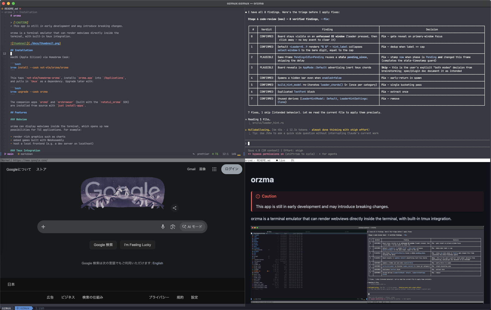

# Introduction

> [!WARNING]
> orzma is in early development and may introduce breaking changes.

orzma is a terminal emulator that can render web pages inside the terminal. A
program running in an orzma pane can place a live web page among its own text
and exchange messages with it, so a terminal app can show rendered Markdown,
diagrams, or a website without leaving the terminal. orzma also splits its
window into panes, so you do not need a separate terminal multiplexer.

This guide describes orzma {{#include ../../../VERSION}}.

## Features

- **Web pages in the terminal.** A program places web pages among its own
  text and exchanges messages with them. A Rust SDK does the protocol work
  for the program, and a TypeScript package types the page's side.
- **Panes and workspaces.** Split the window into panes, and keep several
  layouts as workspaces in a tab bar.
- **Vi mode.** Move over the screen and the scrollback with vi keys, and
  select and copy text without the mouse.
- **Companion apps.** `orzmd` shows Markdown and `orzbrowser` browses the web,
  each inside a pane.
- **One settings file.** Fonts, the cursor, the mouse, and every shortcut are
  set in one TOML file.

## Where to go next

- To install orzma, see [Installation](installation.md). If you are upgrading
  from an earlier release, see [Upgrading](upgrading.md).
- To learn the everyday keys, follow [First Steps](first-steps.md).
- To change settings or shortcuts, see [Configuration](configuration.md) and
  [Key Bindings](key-bindings.md).
- To write a terminal app that shows a web page, see
  [Building Webview Apps](building-webview-apps.md).

The changes in each release are listed on the
[releases page](https://github.com/not-elm/orzma/releases).
